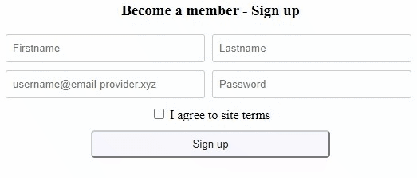

# Smart Form Validator
A highly customizable, "somewhat" declarative approach to HTML form fields validation.

[![NPM version][npm-version-image]][npm-url]
[![Node version][node-version-image]][node-url]
[![NPM Downloads][npm-downloads-image]][package-url]
[![License][license-image]][license-url]
[![Conventional commits][conventional-commits-image]][conventional-commits-url]
[![Tests][ci-image]][ci-url]
[![Coverage][codecov-image]][codecov-url]


## 
<style type="text/css">p[dir="auto"]:has(.demo-img) { text-align: center; }</style>



## Installation

### NPM

```bash
npm install smart-form-validator.js --save
```

Later in your code: 

```css
<link 
  href="https://cdn.jsdelivr.net/npm/smart-form-validator@0.1.0-alpha/dist/css/smart-form-validator.min.css" 
  rel="stylesheet" />
```

```js
import SmartFormValidator from "smart-form-validator";
```

### Using build / minified version

1. Add CSS file to your page: 
   ```css
    <link 
      href="https://cdn.jsdelivr.net/npm/smart-form-validator@0.1.0-alpha/dist/css/smart-form-validator.min.css" 
      rel="stylesheet" />
   ```
2. Add JS file to your page: 
   ```
   <script 
     src="https://cdn.jsdelivr.net/npm/smart-form-validator@0.1.0-alpha/dist/smart-form-validator.min.js"></script>
   ``` 
3. `SmartFormValidator` is now available as a property of the global object.


## Quick start
```html
<html>
  <body>
    <form id="signup-form">
      <input type="text" id="name-field" />
      <input type="email" id="email-field" />
      <button role="submit-button">Sign up</button>
    </form>

    <script src="signup-form-validator.js"></script>
  </body>
</html>
```

```js
// signup-form-validator.js
const form = document.getElementById("test-form");

new SmartFormValidator()
  .addForm(form)
  .addRule({ field: "name-field", type: "ascii" }) // acccepts only ASCII chars including whitespace
  .addRule({ field: "email-field", type: "email" }) // accepts only valid emails (format, not function)
  .watch(); // watch the input fields for changes and enforce the specified constraints
```


The idea behind *Smart Form Validation* is simple. 
A form has input fields; Each field has conditions and constraints that data entered into it must 
satisfy to be considered valid. When a field receives input from a user, 
our code validates the input value to ensure that it satisfies the constraints placed on that field. 
Acting on the result of that check, some form of 
state change may be effected on the input element or the entire form, 
letting the user know whether or not 
they have entered the expected type of value in the field before they even attempt to submit the form 
for processing. In some cases, we may even limit their ability to submit the form if 
they have entered incorrect values into one or more of the form fields.

Smart Form Validation inserts a semantic boundary between these ideas by "separating" them into 
**fields** (receptors of user values), 
**rules** (constraints on fields),
**validators** (checks that ensure that a field's value meets the constraints set for that field), and 
**effects** (state changes (usually visual) on a form field 
that give the user instant feedback regarding the data they have entered in the field).


## Concepts (summary)
- **Fields:** Fields are HTML input elements. They represent the elements we want to validate.
- **Rules:** Rules specify constraints on fields. They specify conditions that fields must pass to be valid.
- **Validators:** Validators check that data entered into fields 
  comply with the constraints specified for those fields. 
- **Effects:** Effects are actions that specify state changes on fiedls based on the results of validation.


## Concepts (details)
### Fields 
A field is a receptor of user data and is the subject of validation. A field can be any HTML element type
such as `input`, `checkbox`, `textarea`, `select`, and `contenteditable` elements.
A field must have an `id` property. A field can optionally also have a `role` and a `getValue` properties.

A `role` attribute with the value of `submit-button` is required 
if we have a `button` or `input` whose `type` is not `submit`
but we want effects that handle submit buttons to have access to the button.

The `getValue` property must be a function. This function is used to get the current value of the field 
if the field is not one of `input`, `checkbox`, `textarea`, `select`, and a `contenteditable` field.

The state of a field changes in response to the data entered 
and its adherence to the constraints or rules defined for/placed on that field.

### Rules
A rule is an object that specifies the constraint on a field.
For any field to be validated, we must attach at least one rule to it.

Rules are plain JavaScript objects with one required property: `field`.
The value of the `field` can be either the element's `id` or the element itself  
if we previously have obtained a reference to the element.

Other properties of a rule are dependent on the type of the field and the constraints we want placed on that field. 

#### Default supported rules
The current default supported rules are: 
- **`type` {String}:** specifies the acceptable data type of the value for this field, 
  one of either (`"alnum"`|`"alpha"`|`"ascii"`|`"email"`|`"number"`). Default is `alnum`.
- **`required` {Boolean}:** specifies whether the field is required (true) or not (false).
- **`length` {Number|Object}:** specifies the accepted (minimum or maximum or both) input length. 
  If the value is a number, it specifies the maximum length.
  If the value is an object, it specifies. the minimum and/or maximum length: 
    - **`length.min` {Number}:** specifies the mininum input length.
    - **`length.max` {Number}:** specifies the maximum input length.
- **`matchCase` {Boolean}:** performs a case-sensitive (true) or case-insensitive (false) validation.
- **`allowWhitespace` {Boolean}:** specifies whether to allow whitespace in the value or not.
- **`regex` {Object|String}:** specifies a custom validation regex. This can be a regex string or regex object.

To specify that a field accepts only numbers that are between 3 to 7 characters, for example, 
we'd use a rule like this: 

```js
const rule = { field: someFieldOrItsId, type: "number", length: { min: 3, max: 7 } };

new SmartformValidator()
  .addForm(form)
  .addRule(rule)
```

**Note:** We can create custom rules and write custom validators that check for and enforce these rule.

### Validators
Validators are rule enforcers. 
A validator is a function that checks that the value entered into a field 
complies with the constraints placed on that field. 

### Default validators
The following validators come built-in corresponding with the built-in rules: 
- **`alphaValidator`:** checks that a field contains only the letters `A - Z`, underscores (`_`), and dashes (`-`).
  The field can also accept whitespace characters with the `allowWhitespace` rule set to true.
  To perform a case-insensitive check, set the `matchCase` rule to `false`.
- **`alphanumericValidator`:** checks that a field contains only the letters `A - Z`, the numbers `0 - 9`, 
  underscores (`_`), and dashes (`-`).
  The field can also accept whitespace characters with the `allowWhitespace` rule set to true.
  To perform a case-insensitive check, set the `matchCase` rule to `false`.
- **`asciiTextValidator`:** checks that a field contains only characters from the ASCII character-set. 
  This validator accepts whitespace characters by default irrespective of the value of the `allowWhitespace` rule. 
  However, we can specify a case-insensitive match by setting the `matchCase` rule to `false`.
- **`emailValidator`:** checks that the value entered into the field has a valid email form.
- **`lengthValidator`:** checks that the value entered in the field is between the minimum 
  and/or maximum specified length.
- **`numberValidator`:** checks that a field contains only the numbers `0 - 9`.
  The field can also accept whitespace characters with the `allowWhitespace` rule set to true.
- **`regexValidator`:** lets us specify a custom regex for validating the field.
- **`requiredFieldValidator`:** takes a boolean value 
  indicating whether the field is required (`true`) or not (`false`).

**Notes:**: 
- For a rule to be enforced, there must be a validator defined to enforce its constraints.
- We can create custom validators that make use of the available rules or that define their own rules.

#### Creating validators
A validator is just a function that is called to, well, *validate* the data entered into a field
The validator function is passed the following positional arguments in order: 
1. **`value`:** the data entered by the user into the field. 
2. **`rule`:** an object containing the rules specified for that field.
   The validator checks that the `value` adheres to the rules.
3. **`prevResult`:** a boolean value that tells the current validator the 
   result of the previous validator in the chain of validators attached to this field.
4. **`extras`:** an object containing any extra information. For example, 
   a checkbox can have the value `on` or `off` and a `checked` state that can be either `true` or `false`.
   The value (`on` or `off`) will be passed as the first argument to the validator.
   The `checked` state will be passed in as `extras.checked`.

A validator should return `true` if the field passed the validation rules. Otherwise it should return `false`.

#### Registering validators 
After creating a validator, we must register it with the `addValidator(name, validator, meta)` method.
`addValidator` takes three arguments:
- **`name` {String} (required):** an arbitrary string that serves as a unique name for the validator.
- **`validator` {Function} (required):** the validator function itself.
- **`meta` {Object} (optional):** an object that holds meta information about the validator. 
  To prevent naming conflict with other validators, we can have a `meta.namespace` property.
  This property should be a string. This string is used in conjunction with the validator `name` 
  to create a unique name for the validator.

#### Tips and best practices for writing validators.
1. Validators should aim at being focused and specific. 
   A validator should deal with just one aspect of the constraints on a field 
   rather than attempting to determine if every constraint on the field has been met.
   For example, instead of having a validator that checks for a `required` state, 
   a maximum length constraint, and whether or not the fields contains numbers, 
   it's better to have separate validators for each of these checks: 
   one to check for `required`, another to enforce the `length` constraint, and yet another to check for numbers.
   Each of these validators will be called with the rule and the result of the previous validator.
2. A validator should return only `true` or `false` values. 
   A validator should not directly effect a side effect on a field in the event of a 
   successful or failed validation. Any such effects should be delegated to [effects](#effects).
   
   Having dedicated effect handlers helps reduce the surface area for surprises 
   arising from side effects during form validation.

   In the end, the validation process is reduced to a binary *passing* or *failing* test.


### Effects
An Effect represents an action to be taken based on the outcome of a field's validatiion.
We can, for example, use an effect to display hints to the user as they enter values into a field, 
to disable the submit button and prevent the form from being submitted unless every other field has valid input, 
or to add some special CSS effects to a field to indicate its state as either *valid* or *invalid*.

#### Creating effects
Every effect is a plain JavaScript object with the following required properties: 
- **`name` {String}:** the effect name is an arbitrary string used to uniquely identify the effect.
- **`valid`{Function}:** a function to be invoked to handle the case when the field passed validation.
  The function is passed the field as the first argument.
- **`invalid` {Function}:** a function to be called to handle the case when the field failed validation.
  The function is passed the field as the first argument.

An effect object may also contain the following optional properties: 
- **`init` {Function}:** an initialization function that is called 
  to perform any initialization tasks for the effect. This function is called once when the effect is registered.
- **`meta` {Object}:** an object that holds meta information (such as author, version, etc) about the effect. 
  An important and recommended property is `effect.namespace` 
  that helps to prevent naming conflict with other effects.
  This property expects a string value that is used in conjunction with the effect `name` property
  to create a unique name for the effect.

#### Registering effects 
After creating an effect, we must register it for it to be applied during form validation. 
An effect can be registered "globally" or "locally".

Registering an effect "globally" makes the effect available to all instances of `SmartFormValidator`.
Just call `useEffect(effect)` statically on the `SmartFormValidator` class like so: 
`SmartFormValidator.useEffect(effect)`.
 
Registering an effect "locally" means the effect is only available to fields within the 
current `SmartFormValidator` instance. To do a "local" effect registration, 
call the `useEffect(effect)` method on an instance. For example: 

```js
const instance = new SmartFormValidator();

instance.useEffect(effect);
```

In both cases, `useEffect` expects the complete effect object as its argument.


## Running the [examples](./examples)
- Run `npm run examples`
- Navigate to *localhost:8080/examples*

  
## Testing
- Run all tests: `npm test`.
- Test a module: `npm test -- --<module_name>`. 
  Example: `npm test -- --SmartFormValidator`.
- Test a module method: `npm test -- --<module_name>::<method_name>`. 
  Example: `npm test -- --SmartFormValidator::addField`.
- Run all tests with coverage report: `npm run test:coverage`.


[npm-url]: https://npmjs.com/package/smart-form-validator
[npm-version-image]: https://img.shields.io/npm/v/smart-form-validator
[node-url]: https://nodejs.org/
[node-version-image]: https://img.shields.io/node/v/smart-form-validator
[package-url]: https://npm.im/smart-form-validator
[npm-downloads-image]: https://img.shields.io/npm/dm/smart-form-validator
[license-url]: https://github.com/simplymichael/smart-form-validator/blob/main/LICENSE.md
[license-image]: https://img.shields.io/github/license/simplymichael/smart-form-validator
[conventional-commits-url]: https://conventionalcommits.org
[conventional-commits-image]: https://img.shields.io/badge/Conventional%20Commits-1.0.0-brightgreen.svg
[ci-url]: https://github.com/simplymichael/smart-form-validator/actions/workflows/run-coverage-tests.yml
[ci-image]: https://github.com/simplymichael/smart-form-validator/workflows/tests/badge.svg
[codecov-url]: https://codecov.io/gh/simplymichael/smart-form-validator
[codecov-image]: https://img.shields.io/codecov/c/github/simplymichael/smart-form-validator?token=IGGXAP7WXO
